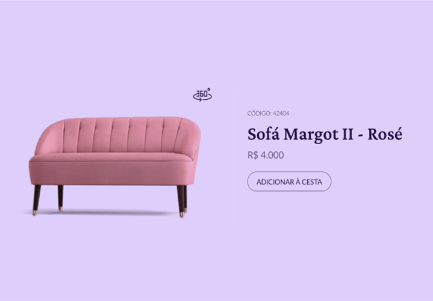

# Desafio 02 - Product Card

  

## 🚀 Projeto feito com:

- HTML(semantica);
- CSS(para estilos);
- JavaScript(para interações);

## 📌 Desafio proposto #boracodar da Rocketseat:

Ao cliclar no botão 360º, a página deve exibir uma das duas opções:

- Trocar a imagem estática pelo gif;
- Trocar a imagem estática por um modelo 3D que possa ser navegável ao arrastar o mouse;

## 🔖 Layout do projeto

Você pode visualizar o layout do projeto através desse <a href="https://www.figma.com/community/file/1195050984449538256">LINK</a>.

## 🙋🏻‍♂️ Quem sou eu:

[@williamhenrique](https://www.linkedin.com/in/henriquewilliam/)
