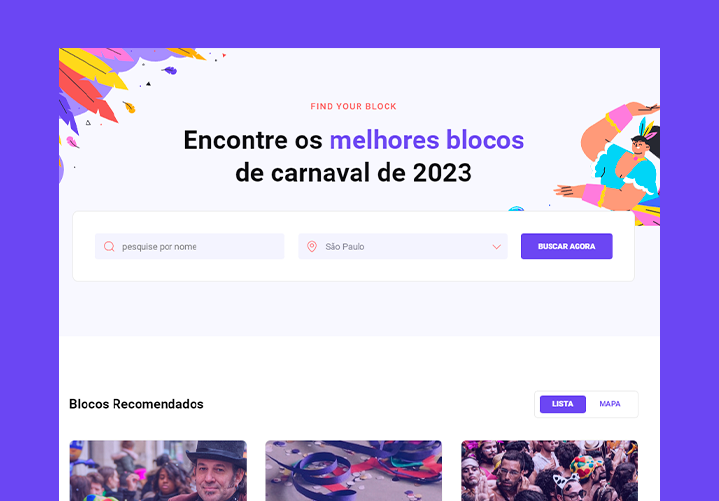

# Desafio 07 - Site de Carnaval

  

## 🚀 Projeto feito com:

- HTML(semantica);
- CSS(para estilos);

## 📌 Desafio proposto #boracodar da Rocketseat:

- Criar uma lading page de carnaval baseado no layout;

## Desafio:

- Futuramente melhorar a qualidade do código em relação a algumas interações;

## 🔖 Layout do projeto

Você pode visualizar o layout do projeto através desse <a href="https://www.figma.com/community/file/1207675804423978995">LINK</a>.

## 🙋🏻‍♂️ Quem sou eu:

[@williamhenrique](https://www.linkedin.com/in/henriquewilliam/)
