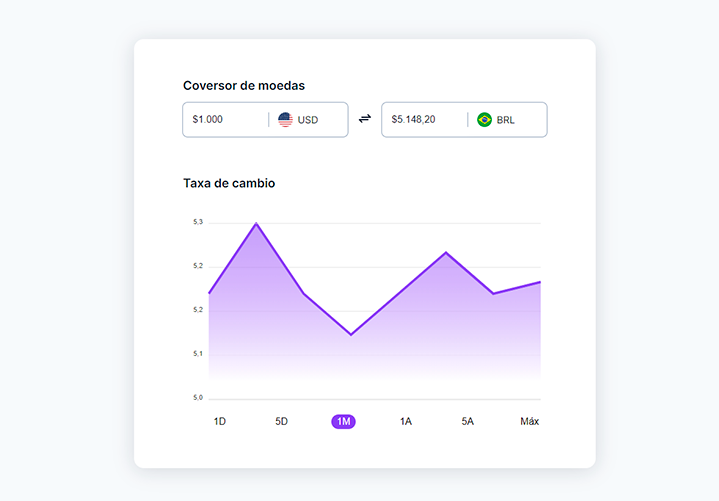

# Desafio 09 - Conversor de moedas

  

## 🚀 Projeto feito com:

- HTML(semantica);
- CSS(para estilos);
- JavaScript;
- <a href="xhttps://apexcharts.com/">Apex Charts</a>;
- <a href="https://github.com/lipis/flag-icons">Flag Icons</a>;

## 🔖 Layout do projeto

Você pode visualizar o layout do projeto através desse <a href="https://www.figma.com/community/file/1212757179376046656">LINK</a>.

## 🙋🏻‍♂️ Quem sou eu:

[@williamhenrique](https://www.linkedin.com/in/henriquewilliam/)
- Projeto feito junto a rocketseat