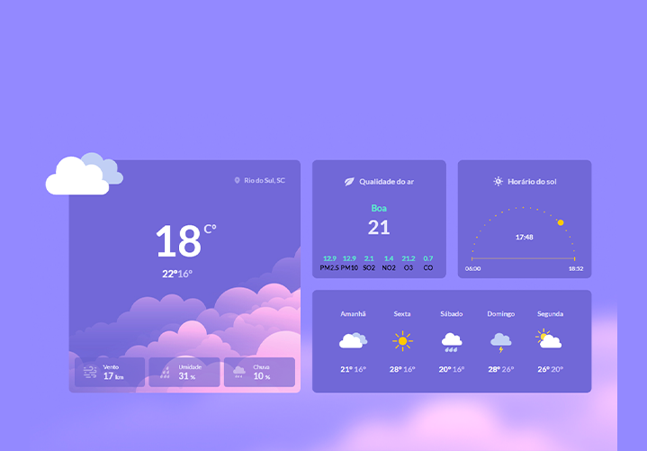

# Desafio 10 - Página de Climas

  

## 🚀 Projeto feito com:

- HTML;
- CSS;
- Figma;

## 📌 Desafio proposto #boracodar da Rocketseat:

- Criar uma página de clima baseada no layout;
- Ser responsivo;

## 📚 Um pouco do que foi aprendido:

- grid-column, grid-row e as linhas virtuais do Grid
- responsividade
- max-content
- alinhamento de div em position:absolute
- alinhamento de div com grid
- alinhamento de div com margin
- flex: 1
- css variables
- cálculo de graus (deg) (transform/rotate/translate)
- css mask e linear-gradient()

## 🔖 Layout do projeto

Você pode visualizar o layout do projeto através desse <a href="https://www.figma.com/community/file/1215291914714743267">LINK</a>.

## 🙋🏻‍♂️ Quem sou eu:

[@williamhenrique](https://www.linkedin.com/in/henriquewilliam/)
