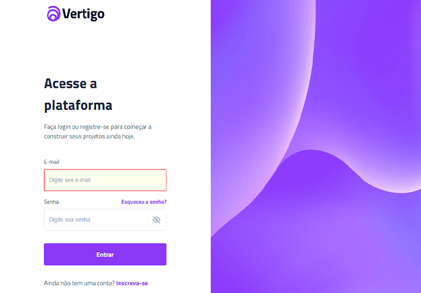

# Desafio 11 - Página de Login

  

## 🚀 Projeto feito com:

- HTML(semantica);
- CSS(para estilos);
- JavaScript e DOM;
- Figma;

## 📌 Desafio proposto #boracodar da Rocketseat:

- Criar uma página de login baseada no layout;
- Ser responsivo;

## 📚 Um pouco do que vimos nesse desafio

- propriedades CSS `all`, `position`, `top`, `right`, `margin-block`, `flex`, `outline`
- seletores CSS `> *`, `+`, `:focus`. `:disabled`, `:hover`, `::-ms-reveal`, `:invalid`
- responsividade
- Javascript: variáveis, estrutura de repetição, condicionais (if/else) e ternários
- DOM: `querySelectorAll()`, `getAttribute()`, `setAttribute()`, `classList`, `.toggle()`

## 🔖 Layout do projeto

Você pode visualizar o layout do projeto através desse <a href="https://www.figma.com/community/file/1217810469465160264">LINK</a>.

## 🙋🏻‍♂️ Quem sou eu:

[@williamhenrique](https://www.linkedin.com/in/henriquewilliam/)