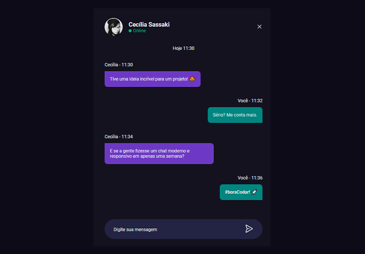

# Desafio 04 - Chat

  

## 🚀 Projeto feito com:

- HTML(semantica);
- CSS(para estilos);
- JavaScript(para interações);

## 📌 Desafio proposto #boracodar da Rocketseat:

- Desenvolver um projeto o mais próximo possível do layout.

## 🔖 Layout do projeto

Você pode visualizar o layout do projeto através desse <a href="https://www.figma.com/community/file/1200070743637495660">LINK</a>.

## 🙋🏻‍♂️ Quem sou eu:

[@williamhenrique](https://www.linkedin.com/in/henriquewilliam/)
